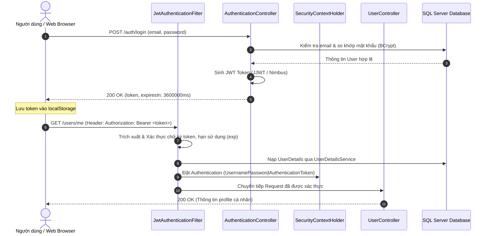

# BÀI TẬP 10: XÁC THỰC VÀ PHÂN QUYỀN VỚI JSON WEB TOKEN (JWT) TRÊN SPRING BOOT 3 & SPRING SECURITY 6

> **Môn học:** Lập trình Web<br>
> **Sinh viên thực hiện:** Đỗ Thanh Thành Tài<br>
> **Mã nguồn GitHub:** [https://github.com/thnhtaii/LTWeb_BT10_3009](https://github.com/thnhtaii/LTWeb_BT10_3009)

---

## 📑 Mục lục
1. [Giới thiệu dự án](#-giới-thiệu-dự-án)
2. [Công nghệ sử dụng](#-công-nghệ-sử-dụng-tech-stack)
3. [Kiến trúc & Cơ chế xác thực JWT](#-kiến-trúc--cơ-chế-xác-thực-jwt)
4. [Cấu trúc thư mục dự án](#-cấu-trúc-thư-mục-dự-án)
5. [Hướng dẫn cài đặt & Cấu hình Database](#-hướng-dẫn-cài-đặt--cấu-hình-database)
6. [Hướng dẫn khởi chạy ứng dụng](#-hướng-dẫn-khởi-chạy-ứng-dụng)
7. [Tài liệu REST API & Hướng dẫn kiểm thử Postman](#-tài-liệu-rest-api--hướng-dẫn-kiểm-thử-postman)
8. [Kiểm thử Giao diện Web (AJAX & Thymeleaf)](#-kiểm-thử-giao-diện-web-ajax--thymeleaf)
9. [Kiểm thử tự động (Unit & Integration Test)](#-kiểm-thử-tự-động-unit--integration-test)
10. [Bảng đối chiếu 10 bước triển khai theo Slide bài giảng](#-bảng-đối-chiếu-10-bước-triển-khai-theo-slide-bài-giảng)

---

## 📌 Giới thiệu dự án

Dự án triển khai cơ chế xác thực không trạng thái (**Stateless Authentication**) sử dụng **JSON Web Token (JWT)** trên nền tảng **Spring Boot 3** và **Spring Security 6**, kết hợp với cơ sở dữ liệu **Microsoft SQL Server / MySQL** và giao diện người dùng tương tác thông qua **AJAX & Thymeleaf**.

Dự án bao gồm 2 phần hoàn chỉnh:
1. **Bài tập ví dụ theo bài giảng JWT:** Triển khai đầy đủ 10 bước trong slide bài giảng `04_JWT.pdf` sử dụng bộ thư viện JJWT `0.12.6`.
2. **Bài tập:** Xây dựng dịch vụ `NimbusJwtService` sử dụng thư viện **Nimbus JOSE + JWT** (`com.nimbusds:nimbus-jose-jwt` v9.40) tương đương với JJWT.

---

## 🛠️ Công nghệ sử dụng (Tech Stack)

| Thành phần | Công nghệ / Thư viện | Phiên bản |
| :--- | :--- | :--- |
| **Java Platform** | Java JDK | 17+ (Tương thích Java 17, 21, 26) |
| **Framework** | Spring Boot | 3.3.4 |
| **Bảo mật** | Spring Security | 6.3.3 (Stateless, CORS, SecurityFilterChain) |
| **JWT Library 1** | `io.jsonwebtoken` (JJWT API, Impl, Jackson) | 0.12.6 |
| **JWT Library 2** | `com.nimbusds:nimbus-jose-jwt` | 9.40 |
| **Database & ORM** | Spring Data JPA / Hibernate 6 | 6.5.3.Final |
| **RDBMS** | Microsoft SQL Server (SQLEXPRESS) / MySQL | 2022 / 2025 / 8.0 |
| **Giao diện Web** | Thymeleaf, Bootstrap 5, Bootstrap Icons, jQuery AJAX | 5.3.0 / 3.7.1 |
| **Kiểm thử** | Postman, JUnit 5, Spring MockMvc, H2 In-Memory DB | 5.10.3 |

---

## 🔒 Kiến trúc & Cơ chế xác thực JWT

### 1. Cấu trúc một chuỗi JWT (Header . Payload . Signature)
- **Header:** Chứa thuật toán mã hóa (HMAC-SHA256 - `HS256`) và kiểu token (`JWT`).
- **Payload (Claims):** Chứa thông tin người dùng (`sub` là email), thời gian phát hành (`iat`), thời gian hết hạn (`exp`), và các custom claims.
- **Signature:** Chữ ký số tạo bởi `HMACSHA256(base64Url(Header) + "." + base64Url(Payload), secretKey)`.

### 2. Quy trình xác thực không trạng thái (Stateless Flow)


---

## 📂 Cấu trúc thư mục dự án

```
BT10_3009/
├── pom.xml                                     # Khai báo Dependencies & Plugin Maven
├── README.md                                   # Tài liệu hướng dẫn đồ án chi tiết
├── jwt_springboot3.sql                         # Script khởi tạo cơ sở dữ liệu mẫu
└── src/
    ├── main/
    │   ├── java/vn/iotstar/
    │   │   ├── JwtSpringboot3Application.java  # Main Application class
    │   │   ├── configs/
    │   │   │   ├── ApplicationConfiguration.java # Cấu hình Beans: UserDetailsService, PasswordEncoder, AuthenticationManager
    │   │   │   ├── SecurityConfiguration.java    # Cấu hình SecurityFilterChain, phân quyền URL & CORS
    │   │   │   └── GlobalExceptionHandler.java   # Xử lý ngoại lệ toàn cục (@RestControllerAdvice)
    │   │   ├── controllers/
    │   │   │   ├── AuthenticationController.java # REST API: /auth/signup & /auth/login
    │   │   │   ├── UserController.java           # REST API: /users/me & /users/
    │   │   │   └── AuthController.java           # Điều hướng giao diện Thymeleaf: /login & /user/profile
    │   │   ├── entity/
    │   │   │   └── User.java                     # Entity ánh xạ bảng users, implements UserDetails, Serializable
    │   │   ├── filter/
    │   │   │   └── JwtAuthenticationFilter.java  # Bộ lọc kiểm tra Header Authorization: Bearer <token>
    │   │   ├── models/
    │   │   │   ├── LoginResponse.java            # DTO trả về Token và expiresIn (ms)
    │   │   │   ├── LoginUserModel.java           # DTO nhận email & password đăng nhập
    │   │   │   └── RegisterUserModel.java        # DTO nhận thông tin đăng ký (fullName, email, password)
    │   │   ├── repository/
    │   │   │   └── UserRepository.java           # Interface JPA Repository tìm kiếm User theo email
    │   │   └── services/
    │   │       ├── AuthenticationService.java    # Nghiệp vụ đăng ký (mã hóa BCrypt) & đăng nhập
    │   │       ├── JwtService.java               # Xử lý JWT bằng JJWT 0.12.6 (theo slide bài giảng)
    │   │       ├── NimbusJwtService.java         # Xử lý JWT bằng Nimbus JOSE + JWT (Bài tập mở rộng)
    │   │       └── UserService.java              # Nghiệp vụ lấy danh sách toàn bộ User
    │   └── resources/
    │       ├── application.properties            # Cấu hình kết nối SQL Server, Secret Key & Expiration
    │       ├── static/js/mainjs.js               # Logic AJAX: Login, lưu localStorage, gọi API & Logout
    │       └── templates/
    │           ├── login.html                    # Giao diện Đăng nhập AJAX
    │           └── profile.html                  # Giao diện Hồ sơ người dùng & Danh sách User AJAX
    └── test/
        ├── java/vn/iotstar/JwtAuthenticationTests.java # Kiểm thử tích hợp tự động với MockMvc
        └── resources/application-test.properties       # Cấu hình H2 Database cho môi trường Test
```

---

## ⚙️ Hướng dẫn cài đặt & Cấu hình Database

### 1. Cấu hình Microsoft SQL Server (Khuyên dùng)
Chạy script SQL sau trong **SQL Server Management Studio (SSMS)**:

```sql
-- 1. Tạo Database
IF NOT EXISTS (SELECT * FROM sys.databases WHERE name = 'BT10_3009')
BEGIN
    CREATE DATABASE BT10_3009;
END
GO

USE BT10_3009;
GO

-- 2. Tạo Bảng users
IF NOT EXISTS (SELECT * FROM sys.tables WHERE name = 'users')
BEGIN
    CREATE TABLE users (
        id INT IDENTITY(1,1) PRIMARY KEY,
        full_name NVARCHAR(50) NOT NULL,
        email VARCHAR(100) NOT NULL UNIQUE,
        password VARCHAR(255) NOT NULL,
        images NVARCHAR(500) NULL,
        created_at DATETIME2 DEFAULT GETDATE(),
        updated_at DATETIME2 DEFAULT GETDATE()
    );
END
GO

-- 3. Thêm tài khoản mẫu (Mật khẩu gốc là: 123456)
IF NOT EXISTS (SELECT * FROM users WHERE email = 'thanhtai@gmail.com')
BEGIN
    INSERT INTO users (full_name, email, password, images, created_at, updated_at)
    VALUES (
        N'Đỗ Thanh Thành Tài',
        'thanhtai@gmail.com',
        '$2a$10$OclhnbFWYhC9KyWGgF8VVO9LP/F4WBB5GJJbh1uz7tNoGGbG0Jo02',
        'https://ui-avatars.com/api/?name=Thanh+Tai&background=0d6efd&color=fff',
        GETDATE(),
        GETDATE()
    );
END
GO

SELECT * FROM users;
GO
```

---

### 2. Cấu hình file `src/main/resources/application.properties`

```properties
spring.application.name=JWT_springboot3
server.port=8005

# Cấu hình Microsoft SQL Server
spring.datasource.url=jdbc:sqlserver://localhost:64078;databaseName=BT10_3009;encrypt=true;trustServerCertificate=true
spring.datasource.driverClassName=com.microsoft.sqlserver.jdbc.SQLServerDriver
spring.datasource.username=sa
spring.datasource.password=123456

# Cấu hình Hibernate & JPA
spring.jpa.hibernate.ddl-auto=update
spring.jpa.open-in-view=false
spring.jpa.properties.hibernate.dialect=org.hibernate.dialect.SQLServerDialect

# Cấu hình Secret Key JWT (Chuỗi 256-bit Hex) & Thời gian sống (1 giờ = 3600000 ms)
security.jwt.secret-key=3cfa76ef14937c1c0ea519f8fc057a80fcd04a7420f8e8bcd0a7567c272e007b
security.jwt.expiration-time=3600000
```

> **Lưu ý:** Nếu SQL Server của bạn sử dụng cổng mặc định `1433`, hãy sửa `localhost:64078` thành `localhost:1433`.

---

## 🚀 Hướng dẫn khởi chạy ứng dụng

### Cách 1: Chạy bằng Terminal / Command Prompt
```bash
mvn spring-boot:run
```

### Cách 2: Chạy trong Spring Tool Suite (STS) / Eclipse
1. Mở STS, chọn menu **File** ➔ **Import...** ➔ **Maven** ➔ **Existing Maven Projects**.
2. Trỏ tới thư mục dự án `BT10_3009`.
3. Chuột phải vào project ➔ **Run As** ➔ **Spring Boot App**.
4. Ứng dụng sẽ chạy tại địa chỉ: `http://localhost:8005`.

---

## 📮 Tài liệu REST API & Hướng dẫn kiểm thử Postman

Dưới đây là danh sách các Endpoint REST API và cấu hình kiểm thử trên Postman:

### 1. Đăng ký tài khoản (`POST /auth/signup`)
- **Mục đích:** Tạo mới tài khoản người dùng, mật khẩu tự động mã hóa BCrypt.
- **URL:** `http://localhost:8005/auth/signup`
- **Method:** `POST`
- **Headers:** `Content-Type: application/json`
- **Body (raw JSON):**
  ```json
  {
    "fullName": "Đỗ Thanh Thành Tài",
    "email": "thanhtai.demo@gmail.com",
    "password": "123456"
  }
  ```
- **Response (200 OK):**
  ```json
  {
    "id": 2,
    "fullName": "Đỗ Thanh Thành Tài",
    "email": "thanhtai.demo@gmail.com",
    "images": null,
    "createdAt": "2026-09-30T02:44:02.092+00:00",
    "updatedAt": "2026-09-30T02:44:02.092+00:00",
    "enabled": true,
    "authorities": [],
    "username": "thanhtai.demo@gmail.com",
    "accountNonExpired": true,
    "accountNonLocked": true,
    "credentialsNonExpired": true
  }
  ```

---

### 2. Đăng nhập lấy JWT Token (`POST /auth/login`)
- **Mục đích:** Xác thực thông tin đăng nhập và sinh chuỗi JWT Bearer Token.
- **URL:** `http://localhost:8005/auth/login`
- **Method:** `POST`
- **Headers:** `Content-Type: application/json`
- **Body (raw JSON):**
  ```json
  {
    "email": "thanhtai@gmail.com",
    "password": "123456"
  }
  ```
- **Response (200 OK):**
  ```json
  {
    "token": "eyJhbGciOiJIUzI1NiJ9.eyJzdWIiOiJ0aGFuaHRhaUBnbWFpbC5jb20iLCJpYXQiOjE3OTA3MzYyNDIsImV4cCI6MTc5MDczOTg0Mn0...",
    "expiresIn": 3600000
  }
  ```

---

### 3. Lấy thông tin cá nhân (`GET /users/me`) — *Yêu cầu Bearer Token*
- **Mục đích:** Lấy thông tin chi tiết của người dùng đang đăng nhập dựa trên token.
- **URL:** `http://localhost:8005/users/me`
- **Method:** `GET`
- **Headers:** 
  - `Authorization: Bearer <chuỗi_token_nhận_được_từ_bước_2>`
- **Response (200 OK):**
  ```json
  {
    "id": 1,
    "fullName": "Đỗ Thanh Thành Tài",
    "email": "thanhtai@gmail.com",
    "images": "https://ui-avatars.com/api/?name=Thanh+Tai&background=0d6efd&color=fff",
    "createdAt": "2026-09-30T01:45:00.000+00:00",
    "updatedAt": "2026-09-30T01:45:00.000+00:00",
    "enabled": true,
    "authorities": [],
    "username": "thanhtai@gmail.com"
  }
  ```

---

### 4. Lấy danh sách toàn bộ người dùng (`GET /users/`) — *Yêu cầu Bearer Token*
- **Mục đích:** Lấy danh sách toàn bộ tài khoản trong cơ sở dữ liệu.
- **URL:** `http://localhost:8005/users/`
- **Method:** `GET`
- **Headers:** 
  - `Authorization: Bearer <chuỗi_token>`
- **Response (200 OK):**
  ```json
  [
    {
      "id": 1,
      "fullName": "Đỗ Thanh Thành Tài",
      "email": "thanhtai@gmail.com"
    },
    {
      "id": 2,
      "fullName": "Nguyễn Hữu Trung",
      "email": "trungnh@hcmute.edu.vn"
    }
  ]
  ```

---

### 5. Kiểm thử các trường hợp bảo mật (Security Edge Cases)
- **Truy cập không có Token:** Gửi `GET /users/me` không có header `Authorization` ➔ Trả về mã lỗi `403 Forbidden`.
- **Token giả mạo / hết hạn:** Gửi `GET /users/me` với `Authorization: Bearer token_khong_hop_le` ➔ Trả về `403 Forbidden` / `401 Unauthorized`.

---

## 🌐 Kiểm thử Giao diện Web (AJAX & Thymeleaf)

Giao diện người dùng được xây dựng hoàn chỉnh với **Bootstrap 5**, **Bootstrap Icons** và **jQuery AJAX**:

### 1. Trang Đăng nhập (`/login`)
- **Địa chỉ truy cập:** [http://localhost:8005/login](http://localhost:8005/login)
- **Thao tác:**
  1. Nhập **Email:** `thanhtai@gmail.com`
  2. Nhập **Password:** `123456`
  3. Nhấn **Login**: AJAX gửi request `POST /auth/login`, nhận token và lưu vào `localStorage.setItem('token', token)`, sau đó tự động chuyển hướng sang trang `/user/profile`.

### 2. Trang Hồ sơ & Quản lý người dùng (`/user/profile`)
- **Địa chỉ truy cập:** [http://localhost:8005/user/profile](http://localhost:8005/user/profile)
- **Tính năng trên giao diện:**
  - **Tự động tải Profile:** AJAX lấy token từ `localStorage`, gắn vào header `Authorization: Bearer <token>` gọi `GET /users/me` để hiển thị Họ tên, Email, Avatar.
  - **Nút "Xem danh sách người dùng":** Nhấn nút để gọi `GET /users/`, dữ liệu được render động vào bảng danh sách người dùng.
  - **Khung JSON Preview:** Hiển thị dữ liệu JSON thô trả về từ REST API.
  - **Nút "Đăng xuất":** Xóa token khỏi `localStorage` và chuyển hướng an toàn về trang `/login`.

---

## ⚡ Kiểm thử tự động (Unit & Integration Test)

Dự án tích hợp sẵn bộ kiểm thử tự động toàn diện trong class [JwtAuthenticationTests.java](src/test/java/vn/iotstar/JwtAuthenticationTests.java) sử dụng `MockMvc` và cơ sở dữ liệu `H2 in-memory`:

```bash
mvn test
```

### Kết quả kiểm thử:
```
[INFO] Running vn.iotstar.JwtAuthenticationTests
[INFO] Tests run: 1, Failures: 0, Errors: 0, Skipped: 0, Time elapsed: 6.463 s -- in vn.iotstar.JwtAuthenticationTests
[INFO] 
[INFO] Results:
[INFO] 
[INFO] Tests run: 1, Failures: 0, Errors: 0, Skipped: 0
[INFO] 
[INFO] ------------------------------------------------------------------------
[INFO] BUILD SUCCESS
[INFO] ------------------------------------------------------------------------
```